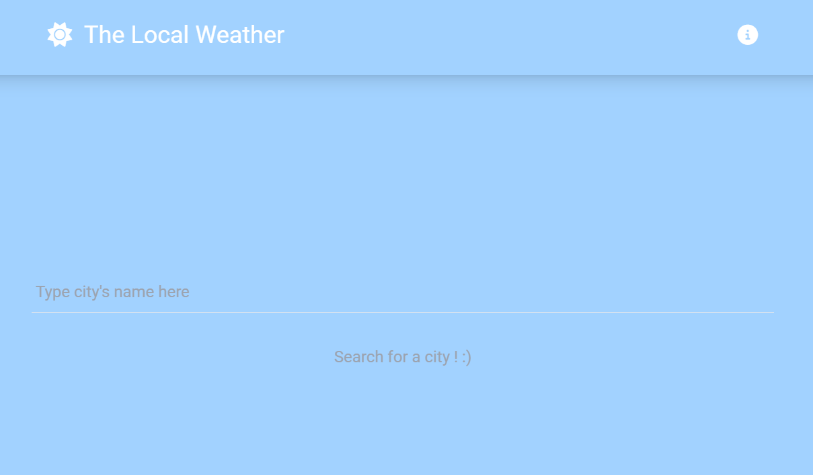
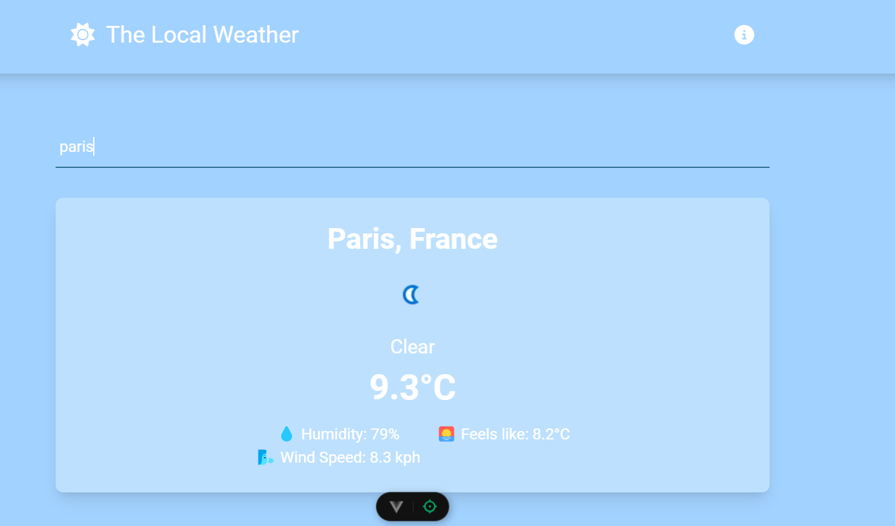

# 🌤️ MeteoApp

**MeteoApp** est une application météo élégante et facile à utiliser, construite avec Vue.js. Elle permet de rechercher les conditions météorologiques actuelles pour diverses villes à travers le monde, avec une interface en bleu pastel et blanc doux pour une expérience agréable.  

## ✨ Fonctionnalités

- 🔍 **Recherche par ville** : Trouvez les informations météo d'une ville en temps réel.
- 🎨 **Interface pastel et animations** : Une interface claire avec des couleurs douces et des animations.
- ℹ️ **Modale d’information** : Consultez une description rapide de l'application via une fenêtre modale.

## 🎨 Aperçu des couleurs

Les couleurs de l'application sont basées sur des tons pastel, créant une atmosphère apaisante et agréable pour l'utilisateur :
- **weather-primary** : 🌊 Bleu pastel clair `#A2D2FF`
- **weather-secondary** : ☁️ Bleu très clair `#BDE0FE`
- **weather-accent** : 🌼 Blanc pastel doux `#FFFCF2`

## 🛠️ Technologies utilisées

- **Vue.js 3** : Framework JavaScript moderne pour construire des interfaces utilisateur réactives.
- **Vue Router** : Gestion de la navigation entre les pages de l'application.
- **WeatherAPI** : Fournit les données météo en temps réel.

## 🚀 Installation et démarrage

1. **Clonez le projet** :  
   ```bash
   git clone https://github.com/ton-utilisateur/MeteoApp.git
   cd MeteoApp
   ```

2. **Installez les dépendances** :  
   ```bash
   npm install
   ```

3. **Lancez l’application** :  
   ```bash
   npm run dev
   ```

4. **Accédez à l'application** : Ouvrez votre navigateur et rendez-vous sur `http://localhost:5173/`

## 📝 Utilisation de l'application

1. **Recherchez une ville** : Dans la barre de recherche, entrez le nom d'une ville ou d'un état pour voir les conditions météorologiques.
2. **Affichez les détails** : Sélectionnez une ville pour accéder à la météo en temps réel et à la modale d’information.
3. **Modale d’aide** : Cliquez sur l'icône ℹ️ dans le coin supérieur pour afficher une modale avec des instructions sur l'utilisation de l'application.

## 📸 Aperçu




## 📚 Ressources et documentation

- **Vue.js Documentation** : [vuejs.org](https://vuejs.org)
- **WeatherAPI Documentation** : [weatherapi.com](https://www.weatherapi.com/docs/)

Aya